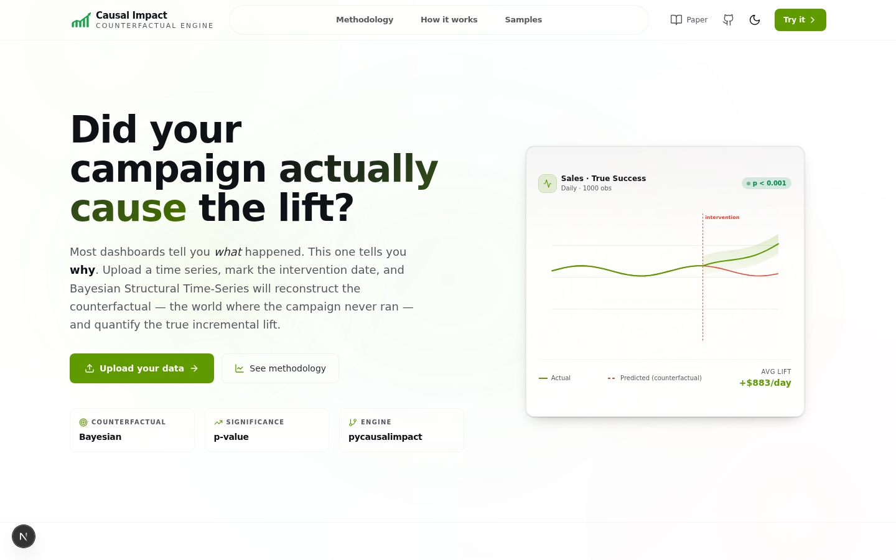
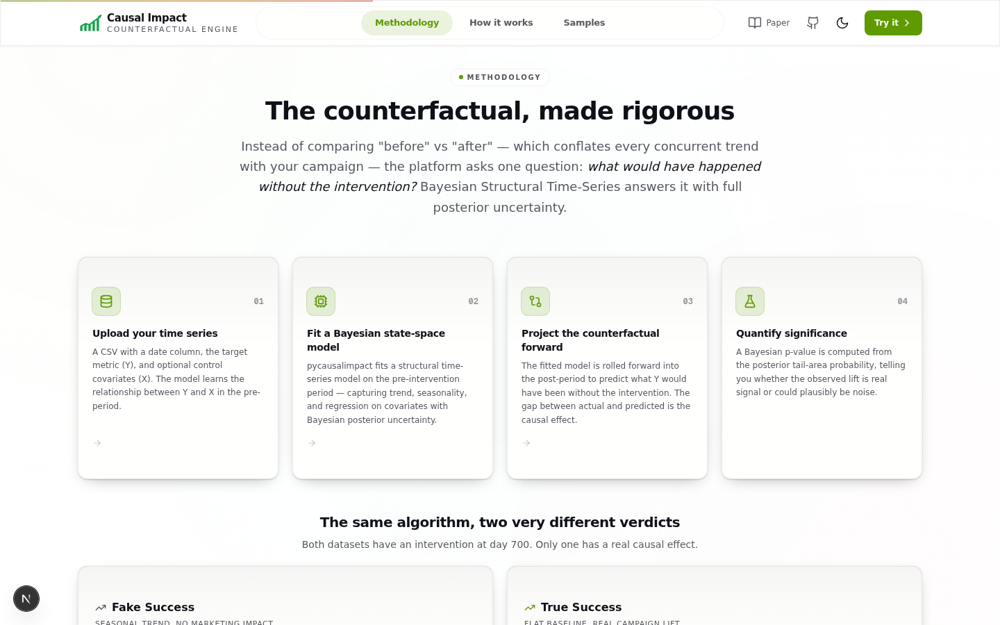
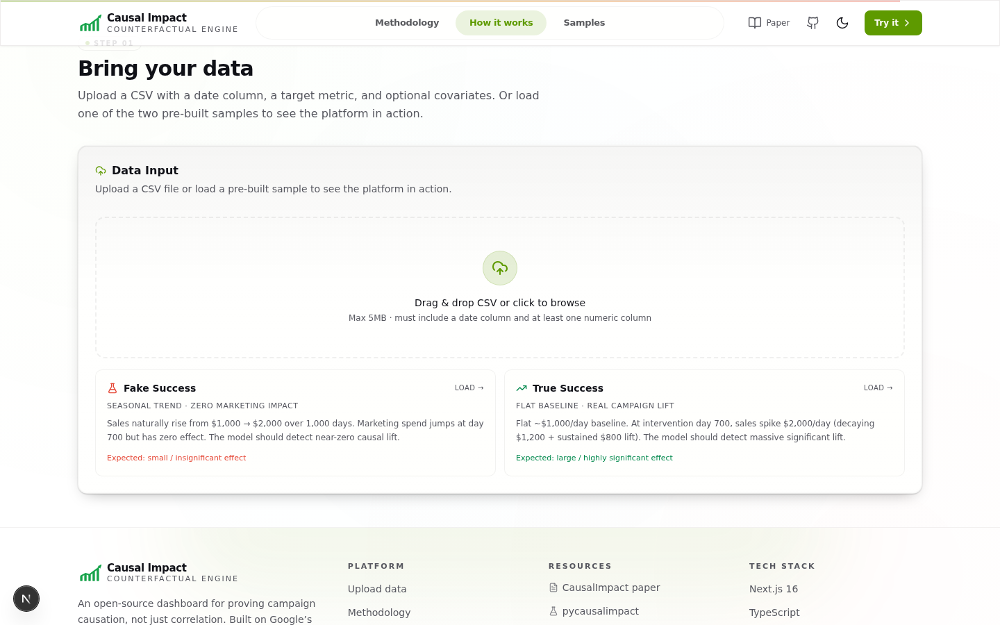
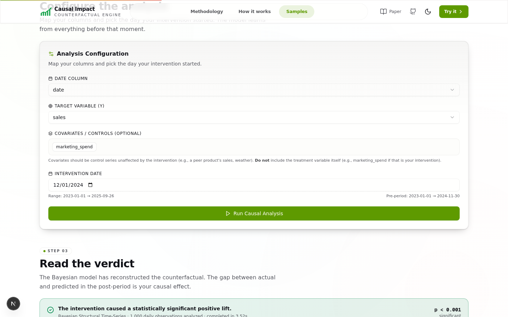
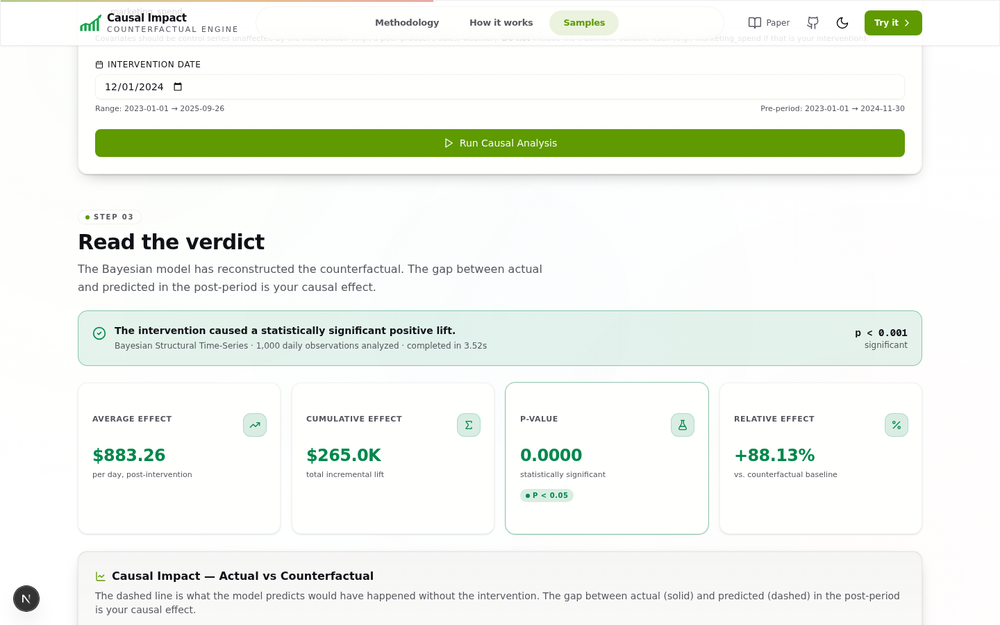

# Causal Impact Platform

**Prove your campaign caused the lift — not just that it correlated with it.**

A web dashboard that uses Bayesian Structural Time-Series (Google's CausalImpact methodology) to answer one question: *"What would have happened if the intervention never occurred?"*

**Live demo: [causal-impact-platform.onrender.com](https://causal-impact-platform.onrender.com/)**

---

## The Problem

When you run a marketing campaign and sales go up, it's tempting to take credit. But sales might have risen anyway — because of seasonality, an existing upward trend, a holiday, or just noise.

**Before/after comparisons are misleading.** They assume everything else stayed constant. It didn't.

```
Sales went up 20% after the campaign.
Did the campaign cause it?  ←  You can't tell from this alone.
Or was it already going to go up?
```

Marketing teams end up taking credit for organic growth. Or worse, they kill campaigns that *were* working because the numbers look flat.

---

## The Solution

Instead of comparing "before vs after," the platform builds a **counterfactual** — a mathematically predicted timeline of what would have happened without the campaign, based on your historical trends and covariates.

The gap between **what actually happened** and **what was predicted** is your true causal effect.

```
Actual sales:     ████████████████  $1,885/day  (after campaign)
Predicted sales:  ████████          $1,002/day  (counterfactual)
                   ───────────────
Causal lift:      +$883/day         ← This is what the campaign actually caused
```

The model also gives you a **p-value** so you know whether the lift is statistically significant or could plausibly be noise.

---

## Screenshots

### Landing page

The hero explains the core idea in one line, with an animated chart mockup showing actual vs counterfactual:



### Methodology

A 4-step explanation of how the Bayesian model fits, projects, and quantifies significance — plus a side-by-side comparison of how the same algorithm gives different verdicts on two scenarios:



### Upload & configure

Drag-and-drop CSV upload (or load a pre-built sample), auto-detected columns, and an intervention date picker:



### Results — metrics

After running the analysis, get a clear verdict banner plus four metric cards (Average Effect, Cumulative Effect, P-Value, Relative Effect):



### Results — charts

An interactive Actual-vs-Counterfactual chart with a 95% confidence band and intervention marker, plus a daily Point Effects bar chart:



---

## How it works (in 4 steps)

1. **Upload** a CSV with a date column, a target metric (Y), and optional control covariates (X)
2. **Pick the intervention date** — the day your campaign launched
3. The Bayesian model **fits on the pre-intervention data**, learning the trend, seasonality, and covariate relationships
4. The model **projects forward** to predict what Y would have been without the intervention. The gap between actual and predicted is your causal effect.

---

## Try it with two sample datasets

The platform ships with two pre-built datasets so you can see it work immediately:

| Dataset | Setup | What the model should find |
|---|---|---|
| **Fake Success** | Strong seasonal upward trend. Marketing spend jumps at day 700 but has zero real effect. | Small / insignificant effect (~$189/day) — most of the "lift" was already baked into the trend |
| **True Success** | Flat ~$1,000/day baseline. At day 700, sales spike $2,000/day. | Large, highly significant effect (~$883/day, p < 0.001) — the spike breaks historical patterns |

The same algorithm, two very different verdicts. That's the point.

---

## Tech stack

- **Frontend**: Next.js 16 · TypeScript · Tailwind CSS 4 · shadcn/ui · Recharts · Framer Motion
- **Backend**: Python 3.12 · [`pycausalimpact`](https://github.com/jamalsenouci/causalimpact) (statsmodels-based)
- **Integration**: Next.js API route spawns a Python subprocess, passing JSON via stdin/stdout

---

## Getting started

### Prerequisites

- Node.js 18+ and [Bun](https://bun.sh)
- Python 3.10+

### Install

```bash
# Frontend dependencies
bun install

# Python dependencies
pip install pycausalimpact pandas statsmodels scipy
```

### Generate the sample datasets

```bash
python scripts/data_generator.py
```

This writes `public/samples/fake_success.csv` and `public/samples/true_success.csv` (1,000 rows each).

### Run

```bash
bun run dev
```

Open `http://localhost:3000` in your browser.

---

## Deployment

This app uses **two runtimes** (Node.js + Python), so it can't deploy to pure-serverless platforms like Vercel or Netlify. Use a container-based platform instead.

### Option 1: Render (recommended, free)

1. Create a free account at [render.com](https://render.com)
2. Click **New → Web Service** → connect your GitHub repo
3. Render will auto-detect the `Dockerfile` — just click **Create Web Service**
4. The free plan (512 MB RAM) is enough for the app. It spins down after 15 min of inactivity and wakes on the next request (~30s cold start).

Alternatively, use the included `render.yaml` Blueprint:
1. In Render dashboard, go to **Blueprints → New Blueprint Instance**
2. Select your GitHub repo — Render reads `render.yaml` and configures everything automatically.

### Option 2: Fly.io (free tier)

```bash
# Install flyctl
curl -L https://fly.io/install.sh | sh

# Launch
fly launch
fly deploy
```

### Option 3: Any VPS with Docker

```bash
docker build -t causal-impact .
docker run -p 3000:3000 -e NODE_ENV=production causal-impact
```

### Environment variables

| Variable | Default | Description |
|---|---|---|
| `NODE_ENV` | `production` | Node environment |
| `PYTHON_BIN` | `python3` (prod) / `/home/z/.venv/bin/python3` (dev) | Path to Python binary |
| `PORT` | `3000` | Server port |

See `.env.example` for reference.

---

## Features

- **Drag-and-drop CSV upload** with auto-detection of date / target / covariate columns
- **Intervention date picker** with validation against your data range
- **Causal Impact chart** — actual (solid) vs counterfactual (dashed) with 95% CI band and intervention marker
- **Daily Point Effects chart** — per-day causal effect bars with CI bands, color-coded by sign
- **4 metric cards** — Average Effect, Cumulative Effect, P-Value (green/red highlight at 0.05), Relative Effect
- **Executive summary + detailed statistical report** in a tabbed view
- **Export** — download the full report as `.txt` and per-day predictions as `.csv`
- **Dark/light theme toggle** (light is default)
- **Fully responsive** across desktop, tablet, and mobile

---

## Project structure

```
.
├── scripts/                  # Python backend
│   ├── causal_engine.py      # Core BSTS analysis (pycausalimpact wrapper)
│   ├── data_generator.py     # Synthetic data generator (2 sample CSVs)
│   ├── run_analysis.py       # JSON stdin→stdout CLI runner
│   └── generate_favicons.py  # PNG favicon exporter from SVG
├── src/
│   ├── app/
│   │   ├── api/analyze/      # POST endpoint → spawns Python subprocess
│   │   ├── globals.css       # Theme tokens + background
│   │   ├── layout.tsx        # Root layout + metadata + favicons
│   │   └── page.tsx          # Main page (orchestrates all sections)
│   ├── components/
│   │   ├── causal/           # All platform components
│   │   └── ui/               # shadcn/ui components
│   └── lib/
│       ├── causal-types.ts   # Shared TypeScript types
│       └── csv-utils.ts      # CSV parsing + column auto-detection
├── public/
│   ├── logo.svg              # SVG logo (bar chart + arrow)
│   ├── favicon-*.png         # PNG favicons (16/32/48px)
│   ├── apple-touch-icon.png  # iOS home screen
│   ├── og-image.png          # Open Graph preview
│   ├── site.webmanifest      # PWA manifest
│   └── samples/              # Pre-built test CSVs
└── docs/                     # Screenshots for README
```

---

## Key technical notes

- **Only pass numeric columns to CausalImpact** — dates must be the DataFrame index, not a column
- **`intervention_date`** must be a string or `pd.Timestamp`, not a `datetime.date`
- **Covariates** must have non-zero variance across the entire time range
- **NaN-safe JSON serialization** — the Python runner uses `allow_nan=False` and converts NaN to `null`

---

## Project documentation

The original project requirements and architecture decisions are preserved in `docs/` for reference:

- [`docs/project-prompt.md`](docs/project-prompt.md) — the full project brief with all requirements
- [`docs/architecture.md`](docs/architecture.md) — high-level architecture and methodology overview
- [`docs/implementation-plan.md`](docs/implementation-plan.md) — the original implementation plan

---

## Acknowledgments

- [Google CausalImpact](https://google.github.io/CausalImpact/) — the original methodology and paper
- [pycausalimpact](https://github.com/jamalsenouci/causalimpact) by Jamal Senouci — statsmodels-based Python port
- Built with Next.js, Tailwind CSS, shadcn/ui, Recharts, and Framer Motion

## License

[MIT](LICENSE) — free to use, modify, and distribute.
