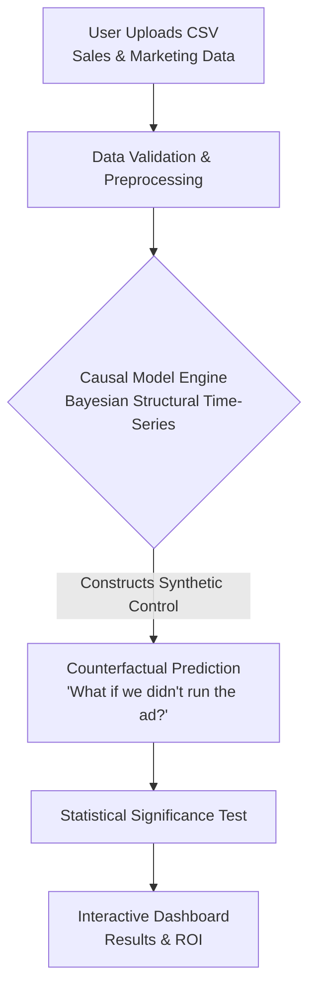

# Automated Causal Inference & A/B Testing Platform

In business, marketing teams often take credit for sales that would have happened anyway. For example, if a company runs a discount on Black Friday, sales will naturally spike. If the marketing team claims *their specific email campaign* caused the spike, how do we know they are telling the truth?

This platform solves that using **Causal Inference**. It calculates the *incremental* lift—proving whether a specific action (like a marketing campaign) actually *caused* a change in metrics, separating it from organic trends or seasonal noise.

---

## 1. How the Algorithm Does the "Real Work"

To figure out the truth, the platform uses an advanced statistical algorithm called **Bayesian Structural Time-Series** (famously implemented in Google's `CausalImpact` library). 

Instead of just comparing "Before" and "After" numbers, the algorithm asks one critical question: ***"What would have happened if the marketing campaign never launched?"***

It answers this by building a **Synthetic Control** (a mathematically predicted timeline based on historical trends):

### Scenario A (The Fake Success)
The algorithm analyzes the data *before* the marketing campaign started and notices a strong upward seasonal trend. It projects that seasonal trend forward into the future. When it compares its projection against the *actual* sales during the campaign, the two lines perfectly overlap. The algorithm mathematically concludes: *"The sales increase was already going to happen. Marketing Impact = $0."*

### Scenario B (The True Success)
The algorithm analyzes the *before* data and sees flat sales. It projects that flat trend forward. However, the *actual* sales during the campaign spike way above the flat projection. The algorithm calculates the exact difference between the flat projection and the actual spike, and concludes: *"This spike breaks historical patterns. Marketing Impact = $5,000."*

---

## 2. Where Does the Data Come From?

For the portfolio piece, we will build a robust **Python Synthetic Data Generator**. This allows us to intentionally generate the two distinct business scenarios (Fake Success vs. True Success) to prove the platform works. 

Users can also upload their own datasets (like standard A/B testing results) via a drag-and-drop UI.

---

## 3. How We Will Check the Results (The UI)

We won't just look at code outputs in a terminal. We will build an interactive web dashboard (using **Streamlit** or **Next.js**) to prove it works visually.

When you load a dataset into the dashboard, it will generate three interactive charts:
1. **The "What If?" Chart:** A line graph showing the *Actual Sales* (solid blue line) versus the *Predicted Sales if the campaign never happened* (dotted red line). In the Fake Success scenario, these lines will overlap. In the True Success scenario, the blue line will soar above the red line.
2. **The Daily Impact Chart:** A bar chart showing exactly how many *extra* sales were generated each individual day after the campaign launched.
3. **The Summary Report:** A clean, executive-level summary at the top of the dashboard that highlights incremental revenue and the confidence interval (e.g., *"We are 95% confident this was caused by the campaign, not random chance."*).

---

## 4. Tech Stack

- **Backend:** Python with `FastAPI` (for high-speed API endpoints).
- **Data Science:** `pycausalimpact` or Microsoft's `DoWhy` (advanced causal inference libraries), and `pandas`.
- **Frontend:** `Next.js` (React) or `Streamlit` (if we want to stay purely in Python for rapid development).
- **Storage:** `SQLite` or in-memory processing for handling the CSV uploads securely.

## Why this stands out
Most data analysts only know how to build dashboards showing *what happened*. By building a Causal Inference tool, you are showing you can answer *why it happened*, which is the most valuable question to any executive.
